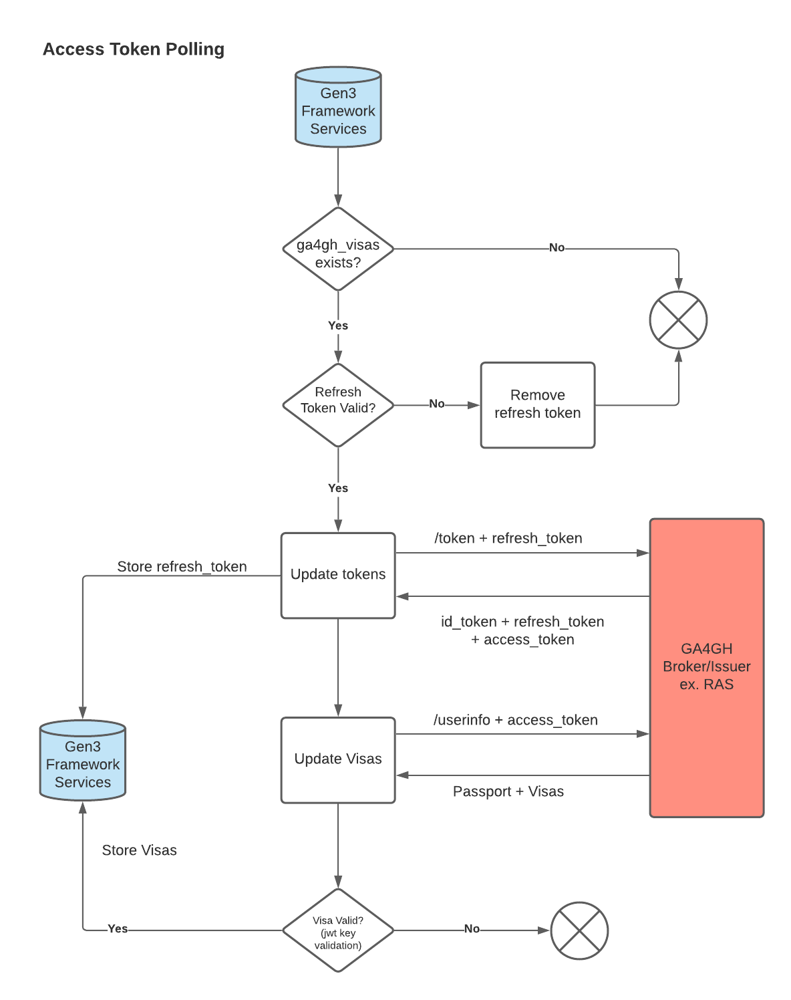

# Access Token Polling

Access token polling is an hourly job that runs to fetch new GA4GH Visas. The process involves  removing expired tokens and visas, fetching valid refresh tokens, and using those refresh tokens to get a set of new refresh tokens and Visas. 
